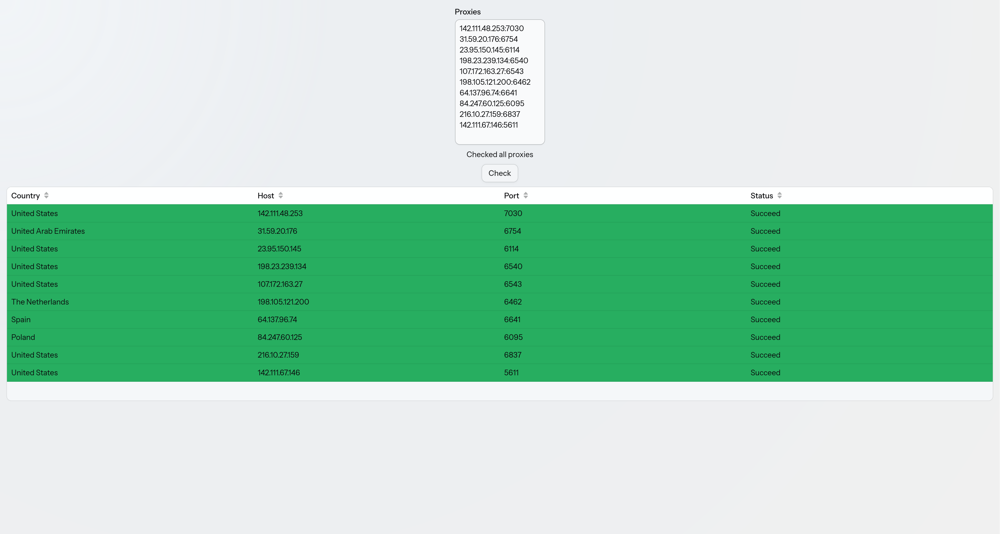

## Proxy Checker (Kotlin + Spring Boot + Vaadin)

A modern, reactive web application built with **Kotlin** to validate proxy lists in real-time.

### 🛠 Tech Stack
* **Backend:** Kotlin 2.2+ with Spring Boot 4.x
* **Frontend:** Vaadin (Flow) for a 100% Java/Kotlin web UI
* **Concurrency:** Virtual Threads lightweight for non-blocking proxy validation
* **Build Tool:** Gradle (Kotlin DSL)

### ✨ Features
* **Bulk Validation:** Paste `host:port` lists directly into the UI.
* **Real-time Updates:** Reactive Grid updates as proxies are verified.
* **Geo-Location:** Automatic country detection for each host.
* **Responsive UI:** Clean, modern interface that works in any browser.

### 🚀 Getting Started
1. **Clone the repo:** `git clone --depth=1 https://github.com/iskaak/proxy-checker.git`
2. **Run the app:** `./gradlew bootRun`
3. **Access the UI:** Navigate to `http://localhost:8080`

### 📋 Usage
1. Enter your proxy list in the text area (format: `host:port`).
2. Click **Check**.
3. View results in the table.

<picture>
    <source srcset="demo/main.avif" type="image/avif">
    <source srcset="demo/main.webp" type="image/webp">
    
</picture>
